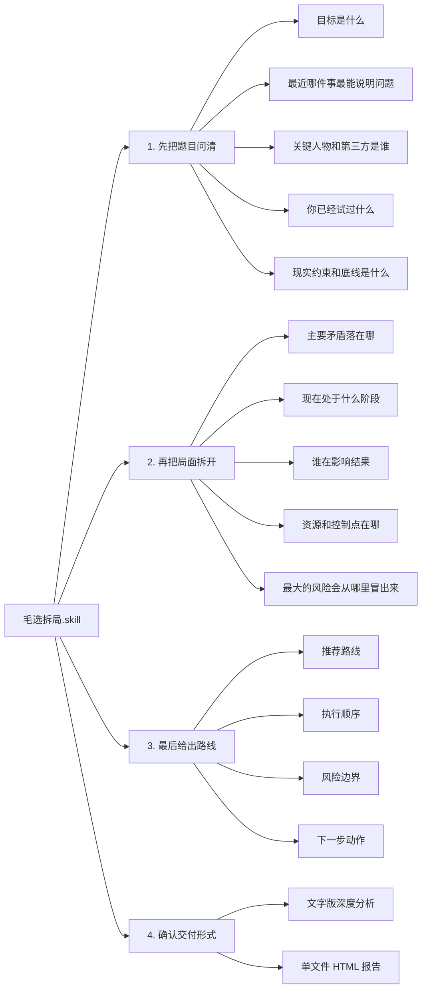

<div align="center">

<h1>毛选拆局.skill</h1>

<p><em>“最近大家都在蒸馏各种 skill。蒸馏的最终目的，是要能够解决问题！”</em></p>

<p>
  <a href="./LICENSE"></a>
  <a href="https://claude.ai/code"></a>
  <a href="https://openai.com/"></a>
  <a href="https://agentskills.io"></a>
</p>

<br>

<p><strong>把《毛泽东选集》蒸馏成一个真能拆现实问题的 skill。</strong></p>

<p>
  不是语录复读机，不是高压话术生成器，也不是“主要矛盾”四个字到处乱扣帽子。<br>
  它只干一件正事：先把问题看清，再把局面拆开，最后给出能往前推的判断和动作。
</p>

<br>

<p><strong>你可以把它理解成，把“新中国最会解决问题的那种脑子”请来，当一次临时参谋。</strong></p>

<br>

<p>
  <a href="#安装">安装</a> ·
  <a href="#使用">使用</a> ·
  <a href="#适用场景">适用场景</a> ·
  <a href="#输出结果">输出结果</a> ·
  <a href="#边界">边界</a> ·
  <a href="#仓库结构">仓库结构</a>
</p>

</div>

---

## 它适合谁

适合那种一眼看过去像是小问题，拆开才发现背后缠着一堆结构的局面：

- 项目推进不动，人人都在忙，但结果就是不动
- 合伙人、同事、上下级之间互相拉扯，信息不透明，责任不清楚
- 团队表面是执行差，实质是路线、阶段和控制点错位
- 关系问题表面是情绪，背后其实是边界、资源、第三方和旧账
- 你在纠结换工作、止损、继续谈、还是直接掀桌，但脑子里还是一锅粥

一句话：

**它擅长的不是“答题”，而是“拆局”。**

## 它和普通“毛选风格 Prompt”有什么不同

- **不抢答**：先调查，再判断，不装一眼看穿全局
- **不空喊**：不堆大词，重点是主要矛盾、阶段、力量、路线、风险
- **不只分析**：最后会落到下一步动作，而不是停在一段气势很足的话
- **能出成品**：除了文字版分析，还能生成可保存、可分享的单文件**HTML 报告**

## 它怎么工作

这不是“你一句，我输出八段”的技能。它更像一个先侦察、再判断、再出手的参谋流程。



如果你想把这张图看成一句人话，那就是：

**先别急着下结论，先把题目看对；题目看对了，方案才有资格往下谈。**

### 第一步：先把题目问清

这一步不分析，只做澄清。

它通常会先补五类信息：

- `目标`：你到底想推进什么结果
- `事件`：最近哪件事最能暴露真实问题
- `人物`：关键人物、第三方、关系人分别是谁
- `尝试`：你已经做过哪些动作，为什么没推进下去
- `约束`：你现在不能碰的底线、现实限制、代价承受范围

如果这些信息不够，它会继续追问，而不是急着端结论上桌。

### 第二步：再把局面拆开

信息补齐之后，才开始真正的“拆局”。

这一步重点看五件事：

- `主要矛盾`：真正卡住结果的核心冲突是什么
- `阶段判断`：这事现在是刚起头、正在拉扯，还是已经接近摊牌
- `关键力量`：谁在推动，谁在拖住，谁表面不动但实际最关键
- `控制点`：决定结果的资源、权限、关系、信息，到底握在谁手里
- `风险点`：哪一步最容易翻车，哪类话、哪类动作不能乱用

### 第三步：最后给出路线

拆清楚之后，才会进入建议阶段。

输出通常不是一句“你应该如何”，而是一整套更像作战方案的东西：

- `推荐路线`：先稳住、先试探、先集中突破，还是先撤退止损
- `执行顺序`：第一步先动谁，第二步碰什么，第三步怎么验证
- `风险边界`：哪些动作能做，哪些动作会直接把局面做坏
- `下一步动作`：给出能立刻执行的行动建议，而不是空泛口号

### 第四步：确认怎么交付

内容想清楚之后，再决定怎么呈现。

- 如果你要快速看明白，就给你`文字版深度分析`
- 如果你要保存、复盘、转发，就给你`单文件 HTML 报告`

也就是说，它的默认逻辑不是“先秀判断”，而是：

**先调查，再拆结构，再定路线，最后再交付成品。**

## 适用场景

- 工作推进：项目卡点、资源分配、跨团队协作、执行失灵
- 团队治理：角色混乱、机制失效、权责不清、反馈回路断裂
- 关系边界：伴侣、朋友、合伙人、上下级之间的长期拉扯
- 自我管理：状态波动、节奏失控、长期目标和现实能力脱节
- 生活决策：换工作、分手、合作、止损、继续投入还是撤退

## 安装

### Claude Code

Claude Code 会从项目里的 `.claude/skills/`，或全局的 `~/.claude/skills/` 读取 skill。

```bash
# 安装到当前项目（在你的项目根目录执行）
mkdir -p .claude/skills
git clone https://github.com/SamadhiFire/maozedong-maoxuan-skill.git .claude/skills/maozedong-maoxuan-skill

# 或安装到全局（所有项目都能用）
git clone https://github.com/SamadhiFire/maozedong-maoxuan-skill.git ~/.claude/skills/maozedong-maoxuan-skill
```

### Codex

如果你在用 Codex，一般放进 `$CODEX_HOME/skills/` 或 `~/.codex/skills/` 即可。

```bash
git clone https://github.com/SamadhiFire/maozedong-maoxuan-skill.git ~/.codex/skills/maozedong-maoxuan-skill
```

### 其他平台

不是每个平台都叫 skill，但大多数 agent 平台都支持“自定义系统提示词 / 自定义技能目录 / 项目级规则”。

最省事的用法：

**霸气地告诉你的Agent！：**

```bash
帮我安装这个skill：https://github.com/SamadhiFire/maozedong-maoxuan-skill?tab=readme-ov-file
```

## 使用

### 最简单的触发方式

把 skill 装好后，直接说这些都行：

- `用毛选帮我分析这个项目为什么推进不动`
- `用教员的方法拆一下我和合伙人的关系`
- `用毛选来帮我梳理这个问题`


### 想让结果更准，最好顺手给这五样

- `目标`：你最想推进的结果是什么
- `事件`：最近一次最说明问题的关键事件
- `人物`：关键人物、第三方、关系人分别是谁
- `尝试`：你已经做过什么
- `约束`：你现在真正的限制、底线和代价

### 一个好用的提问模板

```text
请用毛选拆局的方法帮我分析这件事。

我的目标：
最近关键事件：
涉及人物：
我已经做过的尝试：
我的现实约束：

先别急着下结论，如果信息不够请先追问我。
```

## 输出结果

### 1. 文字版深度分析

适合先把局面看明白。通常会包括：

- 问题重述
- 核心判断
- 当前阶段
- 推荐路线
- 风险提醒
- 下一步动作

### 2. 单文件 HTML 报告

适合保存、复盘、转发，复杂问题还可以带上：

- 时间线
- 关系图
- 路线比较
- 证据链
- 控制点分布
- 执行计划

可参考示例：[`examples/sample-project-report.html`](./examples/sample-project-report.html)

## 边界

这个 skill 不适合下面几种用法：

- 只想摘毛选原文，不想分析现实问题
- 只想学几句“主要矛盾在于你不听话”这种吓人的台词
- 拿方法论给别人扣帽子、压人、操控关系
- 问题本身很轻，用普通常识建议就够了
- 纯技术实现细节问题，不涉及结构判断和路线设计

一句话：

**别把方法论玩成气势道具。**

## 仓库结构

```text
maozedong-maoxuan-skill/
├── SKILL.md                         # 主入口
├── references/                      # 分类、澄清、方法、风险、输出规则
├── examples/sample-project-report.html
├── distill/                         # 蒸馏材料
└── source-texts/                    # 原始文本
```


## 最后一句

这不是教你背《毛选》。

这是把《毛选》蒸馏成一套今天还能用来拆现实问题、推进现实行动的工具。
