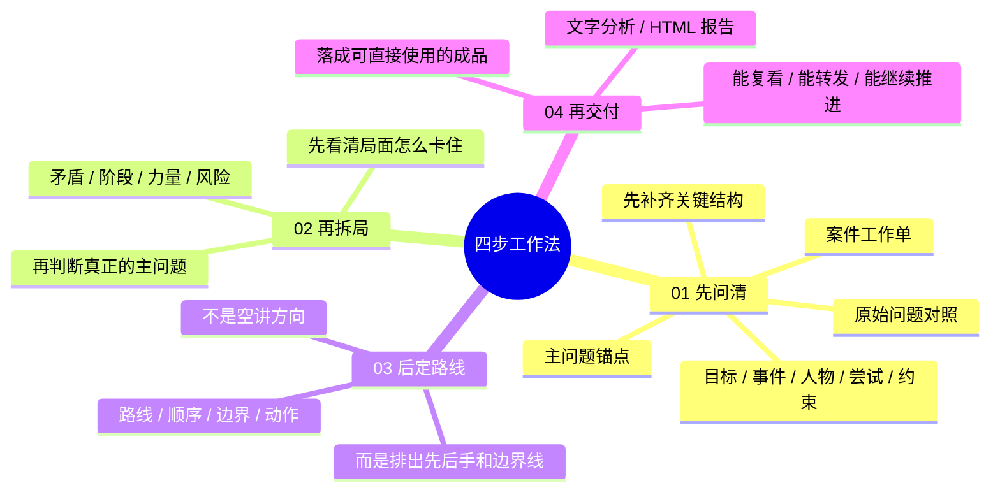
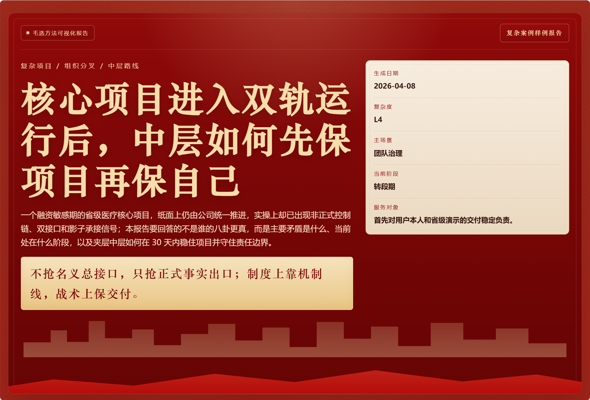
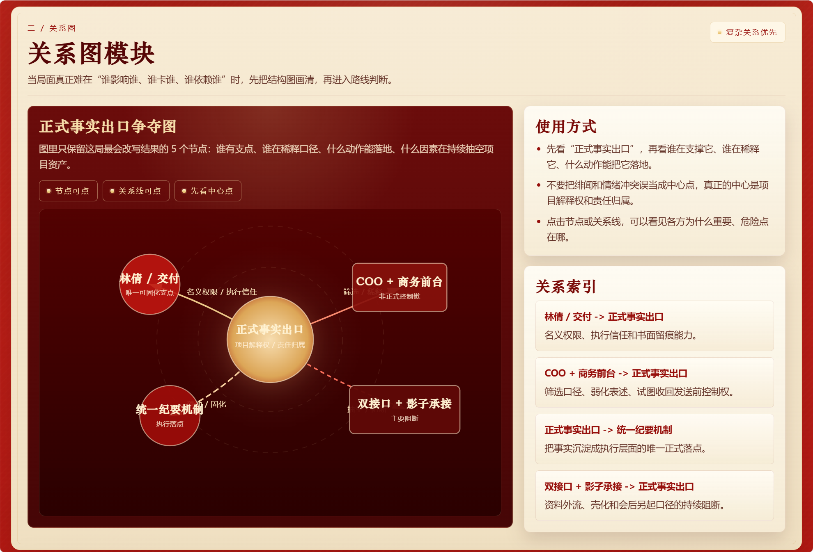
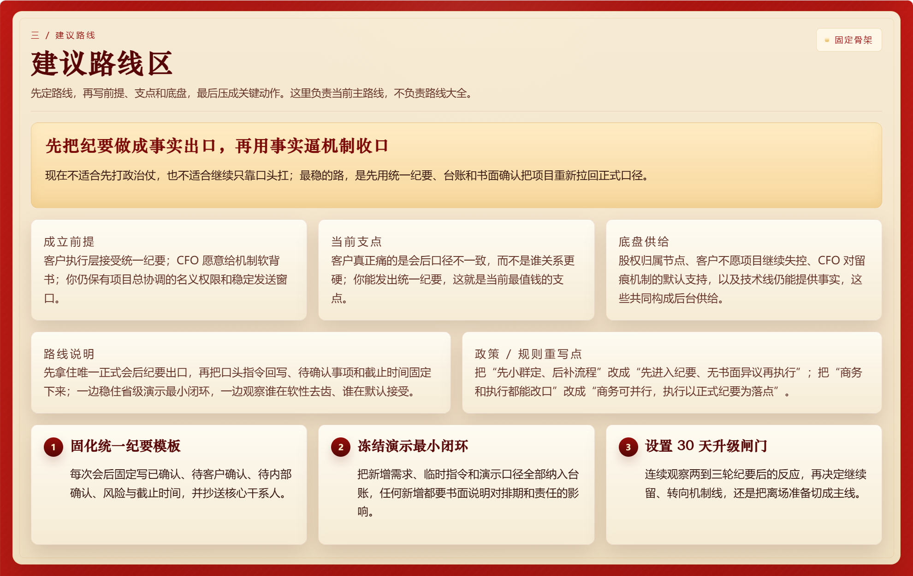
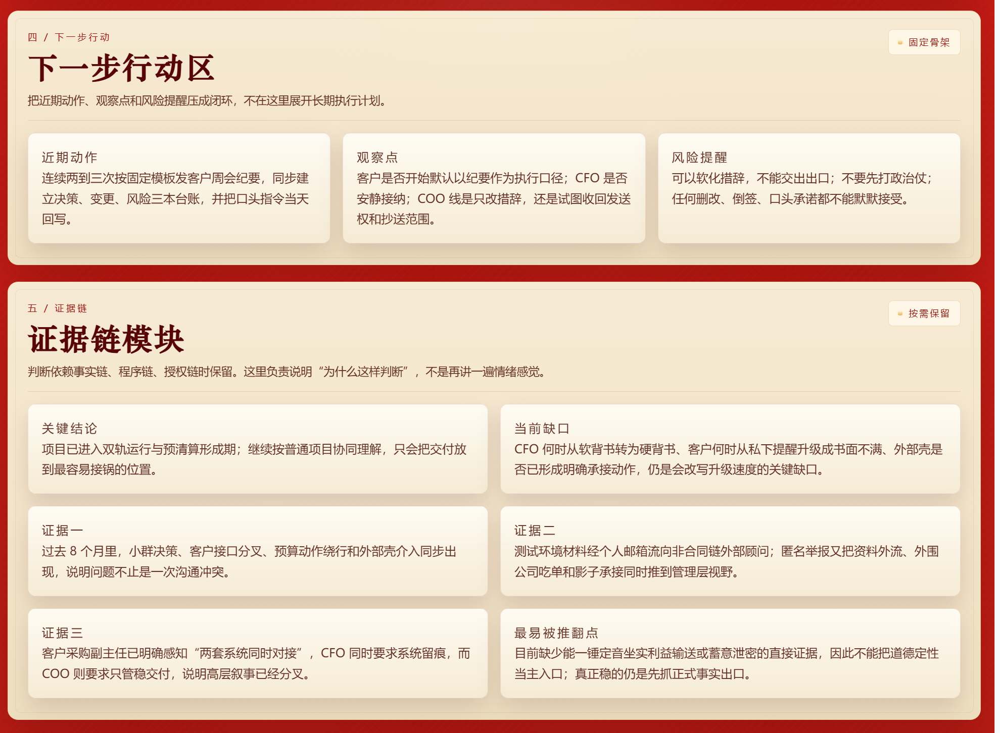
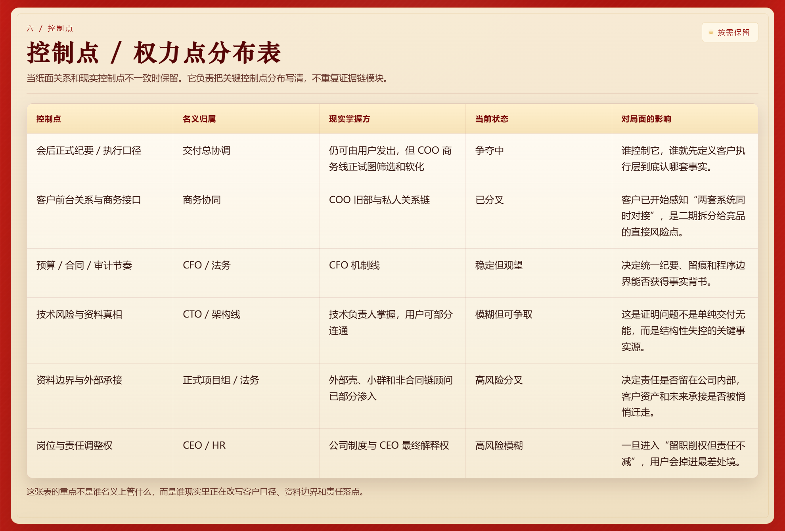
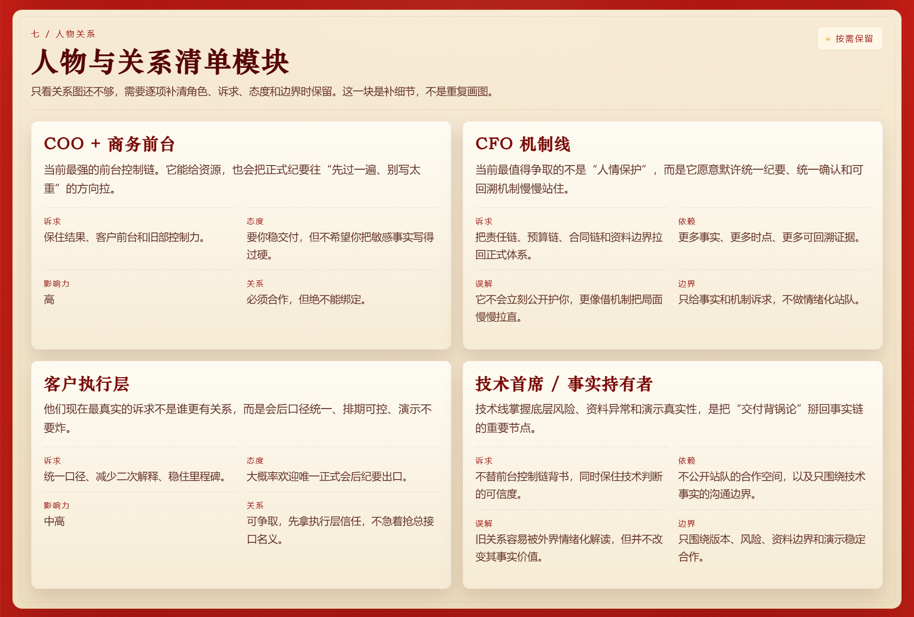
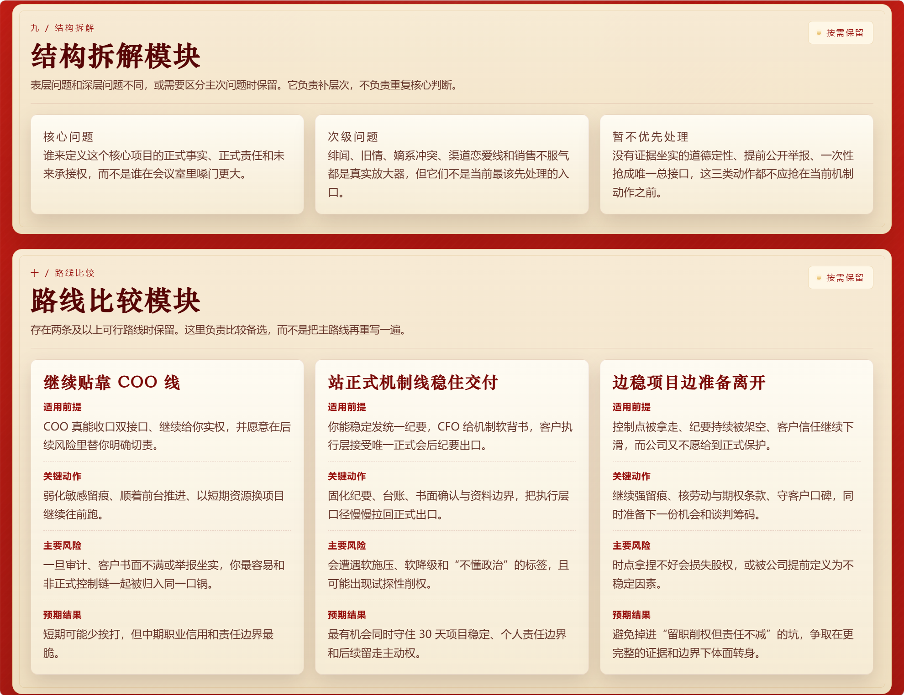
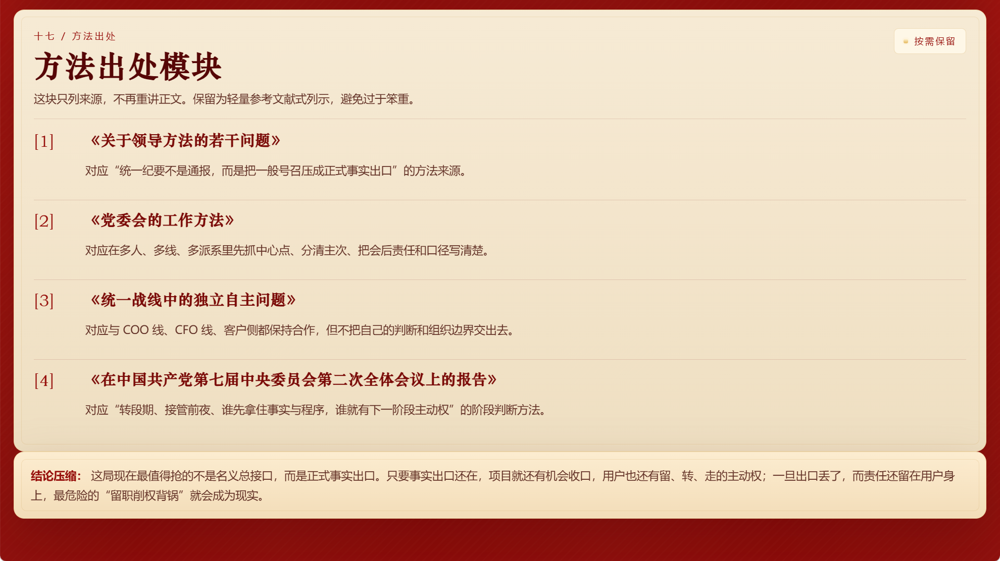

<div align="center">

<h1>毛选拆局.skill</h1>

<p><em>“最近大家都在蒸馏各种 skill。蒸馏的最终目的，是要能够解决问题。”</em></p>

<p>
  <a href="./LICENSE"></a>
  <a href="https://claude.ai/code"></a>
  <a href="https://openai.com/"></a>
  <a href="https://agentskills.io"></a>
</p>

<br>

<p>把《毛泽东选集》蒸馏成一个真能拆现实问题的 skill。</p>

<p>
  不是语录复读机，不是高压话术生成器，也不是“主要矛盾”四个字到处乱扣帽子。<br>
  他只干一件正事：先把问题一步一步梳理清楚，再把局面拆开，最后给出能往前推的判断和动作。
</p>

<br>

<p>你可以把他理解成，把“新中国最会解决问题的那种脑子”请来，当一次临时参谋。</p>

<br>

<p>
  <a href="#安装">安装</a> ·
  <a href="#使用">使用</a> ·
  <a href="#适用场景">适用场景</a> ·
  <a href="#输出结果">输出结果</a> ·
  <a href="#边界">边界</a> ·
  <a href="#仓库结构">仓库结构</a>
</p>

</div>

---

## 他适合谁

更适合这类“表面像摩擦，底层其实是结构问题”的局面：

<table>
  <tr>
    <td width="50%" valign="top">

**项目推进**  
项目推进不动，人人都在忙，但关键结果就是不动。

  </td>
    <td width="50%" valign="top">

**多人拉扯**  
合伙人、同事、上下级之间互相拉扯，信息不透明，责任不清楚。

  </td>
  </tr>
  <tr>
    <td width="50%" valign="top">

**团队错位**  
表面像执行差，实质是路线、阶段和控制点没对齐。

  </td>
    <td width="50%" valign="top">

**关系边界**  
表面像情绪冲突，背后其实是边界、资源、第三方和旧账。

  </td>
  </tr>
  <tr>
    <td colspan="2" valign="top">

**重大选择**  
你在纠结换工作、止损、继续谈还是直接掀桌，但脑子里还是一锅粥。

  </td>
  </tr>
</table>

一句话：

**他擅长的不是“答题”，而是“拆局”。**

## 他和普通“毛选风格 Prompt”有什么不同

不是把语言换成“毛选口吻”，而是把处理问题的方法换掉了：

<table>
  <tr>
    <td width="22%" valign="top">

**不抢答**

  </td>
    <td valign="top">
先调查，再判断，不装一眼看穿全局。
  </td>
  </tr>
  <tr>
    <td width="22%" valign="top">

**不空喊**

  </td>
    <td valign="top">
不堆大词，重点是主要矛盾、阶段、力量、路线和风险。
  </td>
  </tr>
  <tr>
    <td width="22%" valign="top">

**不迷路**

  </td>
    <td valign="top">
长问题先钉主问题、原始问题对照和案件工作单，不靠模型自己“记住”。
  </td>
  </tr>
  <tr>
    <td width="22%" valign="top">

**不只分析**

  </td>
    <td valign="top">
最后会落到下一步动作，而不是停在一段气势很足的话。
  </td>
  </tr>
  <tr>
    <td width="22%" valign="top">

**能出成品**

  </td>
    <td valign="top">
除了文字版分析，还能生成可保存、可分享的单文件 HTML 报告。
  </td>
  </tr>
</table>

## 他怎么工作

这不是“你一句，我输出八段”的技能，而是一套四步工作法：

> **先问清，再拆局；先定线，再交付。**



一句话：

**先把题目看对，再把局面拆开，最后才谈怎么动手。**

## 适用场景

它更适合这类“表面像摩擦，底层其实是结构问题”的局面：

<table>
  <tr>
    <td width="50%" valign="top">

**工作推进**  
项目卡点 / 资源分配 / 跨团队协作 / 执行失灵

常见感受：人人都在忙，但关键结果就是不动。

  </td>
    <td width="50%" valign="top">

**团队治理**  
角色混乱 / 机制失效 / 权责不清 / 反馈回路断裂

常见感受：表面像执行差，实质是规则、接口和控制点没对齐。

  </td>
  </tr>
  <tr>
    <td width="50%" valign="top">

**关系边界**  
伴侣 / 朋友 / 合伙人 / 上下级之间的长期拉扯

常见感受：话说了很多，关系却越谈越乱。

  </td>
    <td width="50%" valign="top">

**自我管理**  
状态波动 / 节奏失控 / 长期目标和现实能力脱节

常见感受：不是不想推进，而是总在关键节点掉链子。

  </td>
  </tr>
  <tr>
    <td colspan="2" valign="top">

**生活决策**  
换工作 / 分手 / 合作 / 止损 / 继续投入还是撤退

常见感受：不是缺建议，而是脑子里线头太多，分不清先看哪根。

  </td>
  </tr>
</table>

一句话：

**越像“结构题”，越适合用它来拆。**


## 使用

### 最简单的触发方式

把 skill 装好后，直接说这些都行：

- `用毛选帮我分析这个项目为什么推进不动`
- `用教员的方法拆一下我和合伙人的关系`
- `用毛选来帮我梳理这个问题`


### 想让结果更准，最好顺手给这五样

- `目标`：你最想推进的结果是什么
- `事件`：最近一次最说明问题的关键事件
- `人物`：关键人物、第三方、关系人分别是谁
- `尝试`：你已经做过什么
- `约束`：你现在真正的限制、底线和代价

### 一个好用的提问模板

```text
请用毛选拆局的方法帮我分析这件事。

我的目标：
最近关键事件：
涉及人物：
我已经做过的尝试：
我的现实约束：

先别急着下结论，如果信息不够请先追问我。最后帮我输出一份HTML报告。
```

## 输出结果

### 1. 文字版深度分析

适合先把局面看明白。通常会包括：

- 问题重述
- 核心判断
- 当前阶段
- 推荐路线
- 风险提醒
- 下一步动作

### 2. 单文件 HTML 报告

适合保存、复盘、转发，复杂问题还可以带上：

- 时间线
- 关系图
- 路线比较
- 证据链
- 控制点分布
- 执行计划

这类报告不是把长文原样搬进网页，而是把“核心判断 -> 关系结构 -> 建议路线 -> 证据与控制点 -> 方法出处”排成一份可以直接复看和转发的单文件成品。

下面这组预览只展示几个关键模块，不追求完整，只负责让人一眼看出这份 HTML 报告是什么样子。

#### 报告预览

**1. 封面与总判断**  
先用一屏把问题场景、阶段、服务对象和当前推荐路线压住。

<p align="left">
  
</p>

**2. 关系图模块**  
先看谁影响谁、谁卡谁、谁依赖谁，再进入路线判断。

<p align="left">
  
</p>

**3. 建议路线区**  
把当前主路线、成立前提、支点和关键动作压成一屏。

<p align="left">
  
</p>

**4. 下一步行动与证据链**  
一边给出近期动作和观察点，一边交代“为什么这样判断”。

<p align="left">
  
</p>

**5. 控制点分布表**  
把名义归属和现实掌握方拆开，说明谁在改写口径、责任和边界。

<p align="left">
  
</p>

**6. 人物与关系清单**  
补充各方诉求、态度、依赖和合作边界，不让关系图只停在“谁连着谁”。

<p align="left">
  
</p>

**7. 结构拆解与路线比较**  
把主次问题拆开，再把几条路线放在一起比较，不让判断停在一句口号上。

<p align="left">
  
</p>

**8. 方法出处与结论压缩**  
最后交代这份判断是从哪些方法来的，并用一句话收住结论。

<p align="left">
  
</p>

#### 完整版

- 复杂组织分叉案例输入：[`examples/组织分叉案例输入.md`](./examples/组织分叉案例输入.md)
- 复杂组织分叉案例：[`examples/组织分叉案例报告.html`](./examples/组织分叉案例报告.html)

## 边界

这个 skill 不适合下面几种用法：

- 只想摘毛选原文，不想分析现实问题
- 只想学几句“主要矛盾在于你不听话”这种吓人的台词
- 拿方法论给别人扣帽子、压人、操控关系
- 问题本身很轻，用普通常识建议就够了
- 纯技术实现细节问题，不涉及结构判断和路线设计

一句话：

**别把方法论玩成气势道具。**

## 安装

### Claude Code

Claude Code 会从项目里的 `.claude/skills/`，或全局的 `~/.claude/skills/` 读取 skill。

```bash
# 安装到当前项目（在你的项目根目录执行）
mkdir -p .claude/skills
git clone https://github.com/SamadhiFire/maozedong-maoxuan-skill.git .claude/skills/maozedong-maoxuan-skill

# 或安装到全局（所有项目都能用）
git clone https://github.com/SamadhiFire/maozedong-maoxuan-skill.git ~/.claude/skills/maozedong-maoxuan-skill
```

### Codex

如果你在用 Codex，一般放进 `$CODEX_HOME/skills/` 或 `~/.codex/skills/` 即可。

```bash
git clone https://github.com/SamadhiFire/maozedong-maoxuan-skill.git ~/.codex/skills/maozedong-maoxuan-skill
```

### 其他平台

不是每个平台都叫 skill，但大多数 agent 平台都支持“自定义系统提示词 / 自定义技能目录 / 项目级规则”。

最省事的用法：

**霸气地告诉你的Agent！：**

```bash
帮我安装这个skill：https://github.com/SamadhiFire/maozedong-maoxuan-skill?tab=readme-ov-file
```

## 仓库结构

对外展示的内容主要是这些：

- [`README.md`](./README.md)：项目介绍、安装方式、使用示例和 HTML 预览
- [`LICENSE`](./LICENSE)：MIT 许可
- [`SKILL.md`](./SKILL.md)：Skill 主入口，供 Agent 实际加载

`examples/`

- [`examples/组织分叉案例输入.md`](./examples/组织分叉案例输入.md)：复杂案例输入样例
- [`examples/组织分叉案例报告.html`](./examples/组织分叉案例报告.html)：完整 HTML 报告样例
- `examples/screenshots/`：README 里使用的报告截图预览

`references/`

- `categories/`
  - [`problem-taxonomy.md`](./references/categories/problem-taxonomy.md)
- `clarification/`
  - [`ambiguity-gate.md`](./references/clarification/ambiguity-gate.md)
  - [`focus-anchor.md`](./references/clarification/focus-anchor.md)
  - [`intake-flow.md`](./references/clarification/intake-flow.md)
  - [`problem-restatement.md`](./references/clarification/problem-restatement.md)
  - [`question-packs-by-domain.md`](./references/clarification/question-packs-by-domain.md)
- `html-output/`
  - [`report-build-rules.md`](./references/html-output/report-build-rules.md)
  - [`visual-report-spec.md`](./references/html-output/visual-report-spec.md)
  - [`visual-report-template.html`](./references/html-output/visual-report-template.html)
- `methods/`
  - [`alliance-boundaries.md`](./references/methods/alliance-boundaries.md)
  - [`communication-calibration.md`](./references/methods/communication-calibration.md)
  - [`core-contradiction.md`](./references/methods/core-contradiction.md)
  - [`execution-routes.md`](./references/methods/execution-routes.md)
  - [`forces-resources.md`](./references/methods/forces-resources.md)
  - [`investigation.md`](./references/methods/investigation.md)
  - [`method-index.md`](./references/methods/method-index.md)
  - [`review-loop.md`](./references/methods/review-loop.md)
  - [`stage-judgment.md`](./references/methods/stage-judgment.md)
- `risks/`
  - [`anti-dogmatism.md`](./references/risks/anti-dogmatism.md)
  - [`base-area-spark.md`](./references/risks/base-area-spark.md)
  - [`committee-central-responsibility.md`](./references/risks/committee-central-responsibility.md)
  - [`concentrated-force.md`](./references/risks/concentrated-force.md)
  - [`internal-external-causes.md`](./references/risks/internal-external-causes.md)
  - [`legitimacy.md`](./references/risks/legitimacy.md)
  - [`main-front-shift.md`](./references/risks/main-front-shift.md)
  - [`mass-line-guidance.md`](./references/risks/mass-line-guidance.md)
  - [`middle-forces-hardliners.md`](./references/risks/middle-forces-hardliners.md)
  - [`misuse-boundaries.md`](./references/risks/misuse-boundaries.md)
  - [`no-investigation-no-right-to-speak.md`](./references/risks/no-investigation-no-right-to-speak.md)
  - [`practice-stage-review.md`](./references/risks/practice-stage-review.md)
  - [`principal-contradiction.md`](./references/risks/principal-contradiction.md)
  - [`propaganda-unified-line.md`](./references/risks/propaganda-unified-line.md)
  - [`protracted-war-endgame.md`](./references/risks/protracted-war-endgame.md)
  - [`rectification-criticism.md`](./references/risks/rectification-criticism.md)
  - [`translation-red-lines.md`](./references/risks/translation-red-lines.md)
  - [`united-front-independence.md`](./references/risks/united-front-independence.md)
- `routing/`
  - [`confidence-rules.md`](./references/routing/confidence-rules.md)
  - [`output-mode-routing.md`](./references/routing/output-mode-routing.md)
- `scenarios/`
  - [`learning-growth.md`](./references/scenarios/learning-growth.md)
  - [`life-decisions.md`](./references/scenarios/life-decisions.md)
  - [`relationship-boundaries.md`](./references/scenarios/relationship-boundaries.md)
  - [`scene-index.md`](./references/scenarios/scene-index.md)
  - [`self-management.md`](./references/scenarios/self-management.md)
  - [`team-governance.md`](./references/scenarios/team-governance.md)
  - [`work-execution.md`](./references/scenarios/work-execution.md)


## 最后一句

这不是教你背《毛选》。

这是把《毛选》蒸馏成一套今天还能用来拆现实问题、推进现实行动的工具。
